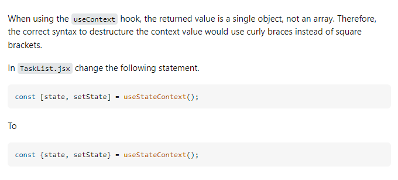

- [Install Tailwind CSS with Vite](https://tailwindcss.com/docs/guides/vite)
- [Install daisyUI as a Tailwind CSS plugin](https://daisyui.com/docs/install/)
- Extensions:
    - Tailwind CSS IntelliSense, 
    - ES7 React/Redux/GraphQL/React-Native snippets 

- [Tailwindcss Glassmorphism Generator](https://tailwindcss-glassmorphism.vercel.app/)
- In ".eslintrc.cjs" file add `"react/prop-types": "off",`

- 

- [useContext is not a function or its return value is not iterable](https://stackoverflow.com/questions/75059890/usecontext-is-not-a-function-or-its-return-value-is-not-iterable)

- state manager: [Zustand](https://docs.pmnd.rs/zustand/getting-started/introduction) || useContext

- [Element: scrollIntoView() method](https://developer.mozilla.org/en-US/docs/Web/API/Element/scrollIntoView)

- [String.prototype.padStart()](https://developer.mozilla.org/en-US/docs/Web/JavaScript/Reference/Global_Objects/String/padStart)